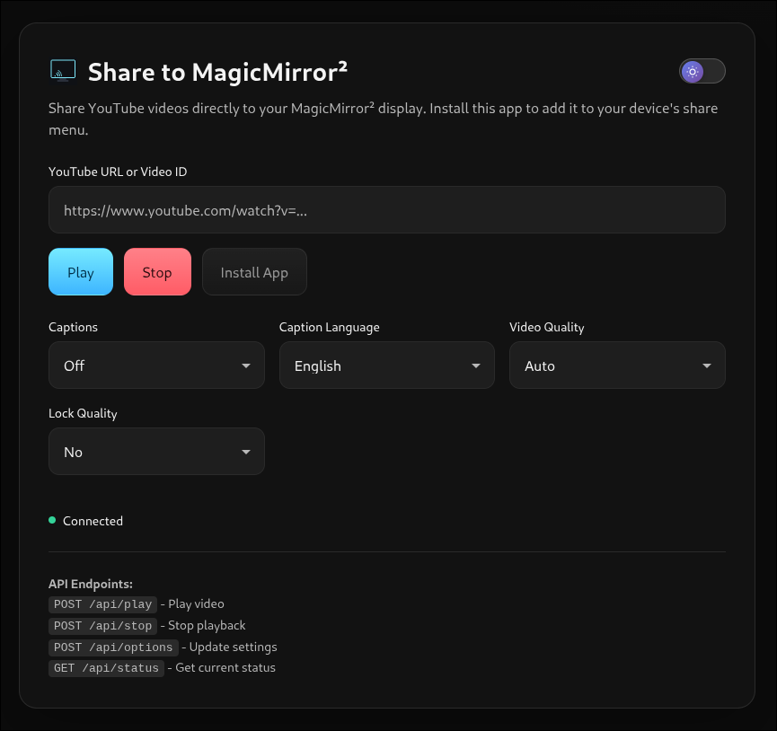
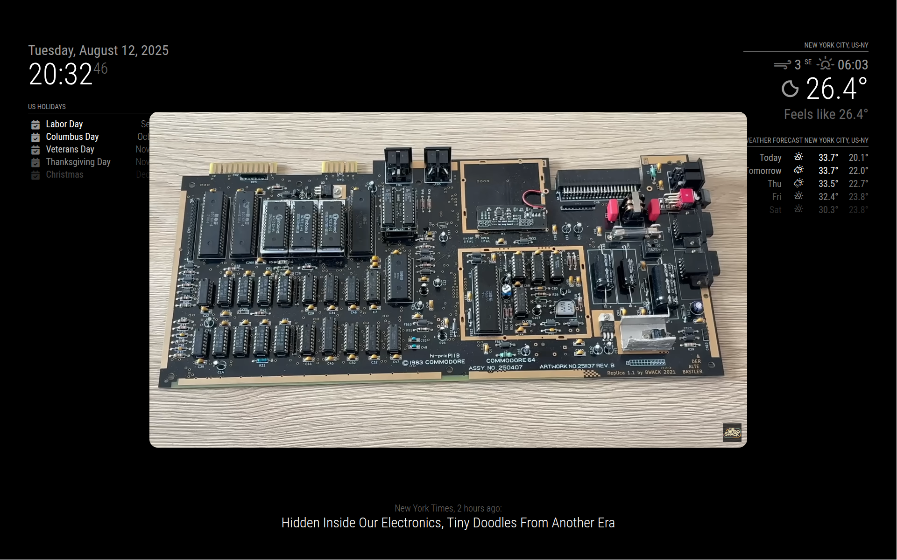

# 📺 MMM-ShareToMirror

> **Modern PWA-powered YouTube sharing for MagicMirror²**

Send YouTube videos from your phone straight to **MagicMirror²** with a tap. Share it, and boom — it appears on your mirror with embedded playback, captions, and quality controls. ✨

[](https://github.com/smartgic/MMM-ShareToMirror)
[](LICENSE)
[](https://nodejs.org/)
[](https://github.com/MagicMirrorOrg/MagicMirror)
[](https://eslint.org/)
[](https://web.dev/progressive-web-apps/)
[](https://developers.google.com/youtube/iframe_api_reference)

---

## ✨ Features

### 🚀 **Core Functionality**
- **PWA-powered receiver** - Installable app with Share Target support on Android
- **Embedded playback** - Videos play directly in MagicMirror² (other modules stay visible)
- **Auto-close screen** - Seamless sharing from apps like YouTube
- **HTTPS-friendly** - Works with Cloudflare Tunnel, ngrok, or local certificates
- **Cross-platform** - Wayland & X11 compatible

### 🎛️ **Advanced Controls**
- **Captions** - On/off toggle with multi-language support (9 languages)
- **Quality control** - Auto to 4K (2160p) with optional quality locking
- **Video controls** - Rewind, pause/resume, and forward buttons in PWA
- **Keyboard shortcuts** - Press `Esc` to stop playback
- **API endpoints** - Full REST API for automation and integration

### 🔒 **Security & Performance**
- **Rate limiting** - Protection against API abuse
- **Input validation** - Sanitized and validated user inputs
- **Security headers** - XSS protection, content type validation
- **Error handling** - Comprehensive error recovery and logging
- **Memory management** - Proper cleanup to prevent leaks

### ♿ **Accessibility**
- **Screen reader support** - Full ARIA labels and semantic HTML
- **Keyboard navigation** - Complete keyboard accessibility
- **Reduced motion** - Respects user motion preferences
- **High contrast** - Optimized for visibility
- **Mobile responsive** - Works perfectly on all screen sizes

---

## 📸 Screenshots

| PWA Home | MagicMirror Overlay |
|----------|---------------------|
|  |  |

---

## 📋 Requirements

### **System Requirements**
- **MagicMirror²** v2.32.0+ (Electron included)
- **Node.js** 18+ (LTS recommended)
- **Network access** from your phone to MagicMirror²
- **Open TCP port** (default: 8570)

### **Mobile Requirements**
- **Android**: Chrome 88+ (for Share Target support)
- **iOS**: Safari 14+ (manual URL entry)
- **HTTPS strongly recommended** for PWA features

---

## 📦 Installation

### **Quick Install**
```bash
cd ~/MagicMirror/modules
git clone https://github.com/smartgic/MMM-ShareToMirror.git
cd MMM-ShareToMirror
npm install
```

### **Configuration**
Add to your `config/config.js`:

```javascript
{
  module: "MMM-ShareToMirror",
  position: "bottom_center", // Can be any position
  config: {
    // Server settings
    port: 8570,
    https: {
      enabled: false,        // Set to true for HTTPS
      keyPath: "",          // Path to SSL private key
      certPath: ""          // Path to SSL certificate
    },
    
    // Display settings
    invisible: true,        // Hide module (recommended)
    
    // Video overlay settings
    overlay: {
      width: "70vw",
      maxWidth: "1280px",
      aspectRatio: "16 / 9",
      top: "50%",
      left: "50%",
      zIndex: 9999,
      borderRadius: "18px",
      boxShadow: "0 10px 40px rgba(0,0,0,.55)"
    },
    
    // Caption settings
    caption: {
      enabled: false,       // Enable captions by default
      lang: "en"           // Language: en, fr, es, de, it, pt, ja, ko, zh
    },
    
    // Quality settings
    quality: {
      target: "auto",       // auto, 144p, 240p, 360p, 480p, 720p, 1080p, 1440p, 2160p
      floor: null,          // Minimum quality
      ceiling: null,        // Maximum quality
      lock: false          // Prevent quality changes during playback
    }
  }
}
```

---

## 📱 Usage

### **First-Time Setup**
1. **Access your MagicMirror²** via HTTPS (required for PWA features)
2. **Open the URL** in your mobile browser: `https://your-mirror-ip:8570`
3. **Install the app** - Tap the "Install" button or use browser menu
4. **Test sharing** - The app should now appear in your share menu

### **Daily Usage**
- **From YouTube app**: Share → **Share to MagicMirror²**
- **From browser**: Copy URL → Open PWA → Paste → **Play**
- **Direct API**: Use REST endpoints for automation

### **Keyboard Controls**
- **Esc** - Stop current video and close overlay
- **Tab** - Navigate through PWA interface
- **Enter** - Play video when URL field is focused

---

## 🔌 API Reference

### **Endpoints**

#### **Play Video**
```bash
POST /api/play
Content-Type: application/json

{
  "url": "https://www.youtube.com/watch?v=dQw4w9WgXcQ"
}
```

**Response:**
```json
{
  "ok": true,
  "mode": "embedded",
  "videoId": "dQw4w9WgXcQ"
}
```

#### **Stop Playback**
```bash
POST /api/stop
```

**Response:**
```json
{
  "ok": true,
  "message": "Playback stopped"
}
```

#### **Video Controls**
```bash
POST /api/control
Content-Type: application/json

{
  "action": "pause"
}
```

**Actions:**
- `pause` - Pause current video
- `resume` - Resume paused video
- `rewind` - Rewind video by specified seconds (default: 10)
- `forward` - Forward video by specified seconds (default: 10)

**For rewind/forward:**
```bash
POST /api/control
Content-Type: application/json

{
  "action": "rewind",
  "seconds": 10
}
```

**Response:**
```json
{
  "ok": true,
  "action": "pause",
  "seconds": null
}
```

#### **Update Options**
```bash
POST /api/options
Content-Type: application/json

{
  "caption": {
    "enabled": true,
    "lang": "fr"
  },
  "quality": {
    "target": "1080p",
    "lock": true
  }
}
```

#### **Get Status**
```bash
GET /api/status
```

**Response:**
```json
{
  "ok": true,
  "state": {
    "playing": false,
    "lastUrl": null,
    "lastVideoId": null,
    "caption": { "enabled": false, "lang": "en" },
    "quality": { "target": "auto", "lock": false }
  },
  "config": {
    "port": 8570,
    "httpsEnabled": false
  },
  "timestamp": "2025-01-08T22:19:07.000Z"
}
```

#### **Health Check**
```bash
GET /api/health
```

**Response:**
```json
{
  "ok": true,
  "status": "healthy",
  "uptime": 3600,
  "timestamp": "2025-01-08T22:19:07.000Z"
}
```

---

## 🛠️ Development

### **Setup Development Environment**
```bash
# Clone and install
git clone https://github.com/smartgic/MMM-ShareToMirror.git
cd MMM-ShareToMirror
npm install

# Install dev dependencies
npm install --save-dev

# Run linting
npm run lint

# Fix linting issues
npm run lint:fix

# Validate everything
npm run validate
```

### **Code Quality**
- **ESLint** - Enforces coding standards
- **JSDoc** - Comprehensive documentation
- **Error handling** - Robust error recovery
- **Security** - Input validation and sanitization
- **Performance** - Optimized for low resource usage

### **Testing**
```bash
# Run all tests
npm test

# Lint code
npm run lint

# Development mode with linting
npm run dev
```

---

## 🔧 Troubleshooting

### **Common Issues**

#### **PWA not appearing in share menu**
- ✅ Ensure you're using **HTTPS** (required for PWA features)
- ✅ **Install the PWA** by opening it once and tapping "Install"
- ✅ **Clear browser cache** and try again
- ✅ Check that your browser supports PWA (Chrome 88+)

#### **Videos not playing**
- ✅ Check **network connectivity** between phone and MagicMirror²
- ✅ Verify **port 8570** is open and accessible
- ✅ Check MagicMirror² **console logs** for errors
- ✅ Ensure **YouTube API** can load (check firewall/proxy)

#### **HTTPS certificate issues**
- ✅ Use **valid SSL certificates** (Let's Encrypt recommended)
- ✅ Check certificate **file paths** in configuration
- ✅ Verify certificate **permissions** (readable by Node.js)
- ✅ Module will **fallback to HTTP** if HTTPS fails

#### **Performance issues**
- ✅ Check **system resources** (CPU, memory)
- ✅ Verify **network bandwidth** is sufficient for video quality
- ✅ Lower **video quality** in settings if needed
- ✅ Check for **memory leaks** in browser dev tools

### **Debug Mode**
Enable detailed logging by checking the browser console and MagicMirror² logs:

```bash
# View MagicMirror² logs
pm2 logs MagicMirror

# Or if running directly
npm start
```

### **API Testing**
Test the API endpoints directly:

```bash
# Test server health
curl http://your-mirror-ip:8570/api/health

# Test video playback
curl -X POST http://your-mirror-ip:8570/api/play \
  -H "Content-Type: application/json" \
  -d '{"url":"https://youtu.be/dQw4w9WgXcQ"}'
```

---

## 🤝 Contributing

We welcome contributions! Please see our [Contributing Guidelines](CONTRIBUTING.md) for details.

### **Development Workflow**
1. **Fork** the repository
2. **Create** a feature branch
3. **Make** your changes with proper documentation
4. **Test** thoroughly (run `npm run validate`)
5. **Submit** a pull request

### **Code Standards**
- Follow **ESLint** configuration
- Add **JSDoc** comments for all functions
- Include **error handling** for all operations
- Write **accessible** HTML with ARIA labels
- Test on **multiple devices** and browsers

---

## 📄 License

This project is licensed under the **Apache License 2.0** - see the [LICENSE](LICENSE) file for details.

---

## 🙏 Acknowledgments

- **MagicMirror²** community for the amazing platform
- **YouTube** for the IFrame API
- **PWA** standards for modern web app capabilities
- **Contributors** who help improve this module

---

## 📞 Support

- **Issues**: [GitHub Issues](https://github.com/smartgic/MMM-ShareToMirror/issues)
- **Discussions**: [GitHub Discussions](https://github.com/smartgic/MMM-ShareToMirror/discussions)
- **MagicMirror² Forum**: [Community Forum](https://forum.magicmirror.builders/)

---

**Made with ❤️ by Smart'Gic™**

*Transform your MagicMirror² into the ultimate smart display for sharing and enjoying content from anywhere.*
